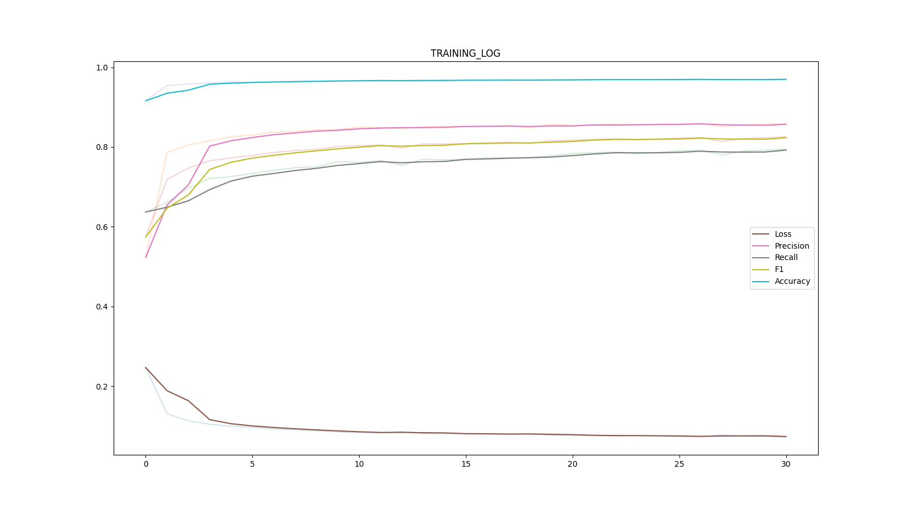
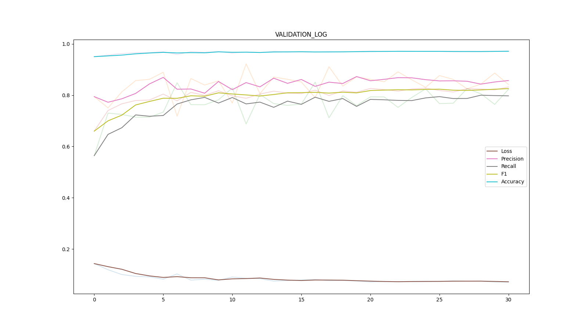

#### This is a working example of [easytorch](https://github.com/sraashis/easytorch). A quick and easy way to run pytorch based neural network experiments. 
* This example consist of retinal blood vessel segmentation on two datasets- DRIVE<sub>[1]</sub>, and STARE<sub>[2]</sub>. 
* We have shown a per-data experiment setup, and pooled version of all datasets in this repo. Please check net_logs folder for results.

**``
Please note that one MUST cite the original authors if these dataset are used in your research (references at the end)
``**

- **Install pytorch and torchvision from [official website](https://pytorch.org/)**
- **pip install easytorch**
1. Initialize the **dataspecs.py** as follows. Non existing directories will be automatically created in the first run.
```python
import os

sep = os.sep
DRIVE = {
    'name': 'DRIVE',
    'data_dir': 'DRIVE' + sep + 'images',
    'label_dir': 'DRIVE' + sep + 'manual',
    'split_dir': 'DRIVE' + sep + 'splits',
    'label_getter': lambda file_name: file_name.split('_')[0] + '_manual1.gif',
    'mask_getter': lambda file_name: file_name.split('_')[0] + '_mask.gif'
}
STARE = {
    'name': 'STARE',
    'data_dir': 'STARE' + sep + 'stare-images',
    'label_dir': 'STARE' + sep + 'labels-ah',
    'split_dir': 'STARE' + sep + 'splits',
    'label_getter': lambda file_name: file_name.split('.')[0] + '.ah.pgm',
}

```
* **name** Unique name for each specification used.
* **data_dir** is the path to images/or any data points.
* **label_dir** is the path to ground truth.
* **mask_dir** is the path to masks if any.
* **label_getter** is a function that gets corresponding ground truth of an image/data-point from **label_dir**.
* **mask_getter** is a function that gets corresponding mask of an image/data-point from **mask_dir**.
* **splits** (optional) directory should consist train-validation-test split as a json files with the same keys. If no splits are provided, splits are created based on value on -nf/--num_folds(number of folds in k-fold cross validation/default k=10) automatically.

2. Override our custom dataloader(**ETDataset**) and implement each item parser as in the example.
3. Initialize our custom neural network trainer(**ETTrainer**) and implement logic for one iteration, how to save prediction scores. Sometimes we want to save predictions as images and all so it is necessary. Initialize log headers. More in example.
4. Implement the entry point

```python
import argparse
from easytorch.utils.defaultargs import ap
import dataspecs as dspec

from easytorch import EasyTorch
from classification import MyTrainer, MyDataset

ap = argparse.ArgumentParser(parents=[ap], add_help=False)
dataspecs = [dspec.DRIVE, dspec.STARE]
runner = EasyTorch(ap, dataspecs)

if __name__ == "__main__":
    runner.run(MyDataset, MyTrainer)
    runner.run_pooled(MyDataset, MyTrainer)

```
### Finally, Start training:

##### Parameters used in **Training+Validation+Test**
    * $python main.py -p train -nch 1 -e 21 -b 8 -sp True -r 1
##### To run **Only Test**
    * $python main.py -p test -nch 1 -e 21 -b 8 -sp True -r 1

### Results for DRIVE, STARE and pooled are in net_logs folder
* It should be trained more epochs to gets state of the art result. 

### Dataset pooling
It is an useful feature that can combine datasets without moving the datasets from their original locations, and feed to the network as if we are training on one large dataset. In this example, we have ran the following experiments:
* Train one model on DRIVE dataset with single train, validation, and test split.
* Train 5-models on STARE datasets with 5-fold split(5 fold cross-validation).
* Train one model on conbination of one DRIVE split, and one STARE split.
* At the moment, the pool only has capability to combine one split of each dataset. In case there are multiple in the splits directory, it will pick the first one.

1. DRIVE dataset logs.
    * Training log
        
    * Validation log
        

2. We ran 5-fold cross validation for STARE dataset. The following are logs of the first fold.
    * Scores for each folds, and global(combining all folds) in net_logs/STARE/_global_test_scores.csv
    
            |Fold                |Precision|REcall|F1    |Accuracy|
            |--------------------|---------|------|------|--------|
            |STARE_0.json        |0.8869   |0.6588|0.756 |0.9612  |
            |STARE_1.json        |0.8273   |0.8144|0.8208|0.975   |
            |STARE_4.json        |0.7509   |0.8309|0.7889|0.9682  |
            |STARE_3.json        |0.7945   |0.7675|0.7808|0.9643  |
            |STARE_2.json        |0.8663   |0.8235|0.8444|0.9731  |
            |Global              |0.8237   |0.7745|0.7983|0.9684  |

    * Training log
        
    * Validation log
        

3. Pooled version
    * Training log
        
    * Validation log
        
        
## References
1. DRIVE Dataset, J. Staal, M. Abramoff, M. Niemeijer, M. Viergever, and B. van Ginneken, “Ridge based vessel segmentation in color images of the retina,” IEEE Transactions on Medical Imaging 23, 501–509 (2004)
2. STARE Dataset, A. D. Hoover, V. Kouznetsova, and M. Goldbaum, “Locating blood vessels in retinal images by piecewise threshold
       probing of a matched filter response,” IEEE Transactions on Med. Imaging 19, 203–210 (2000)
3. Architecture used, O. Ronneberger, P. Fischer, and T. Brox, “U-net: Convolutional networks for biomedical image segmentation,” in
    MICCAI, (2015)
4. Our paper on vessel segmentation:
    * [Link to arxiv](https://arxiv.org/abs/1903.07803)
    * [Dynamic Deep Networks for Retinal Vessel Segmentation](https://www.frontiersin.org/articles/10.3389/fcomp.2020.00035/abstract)